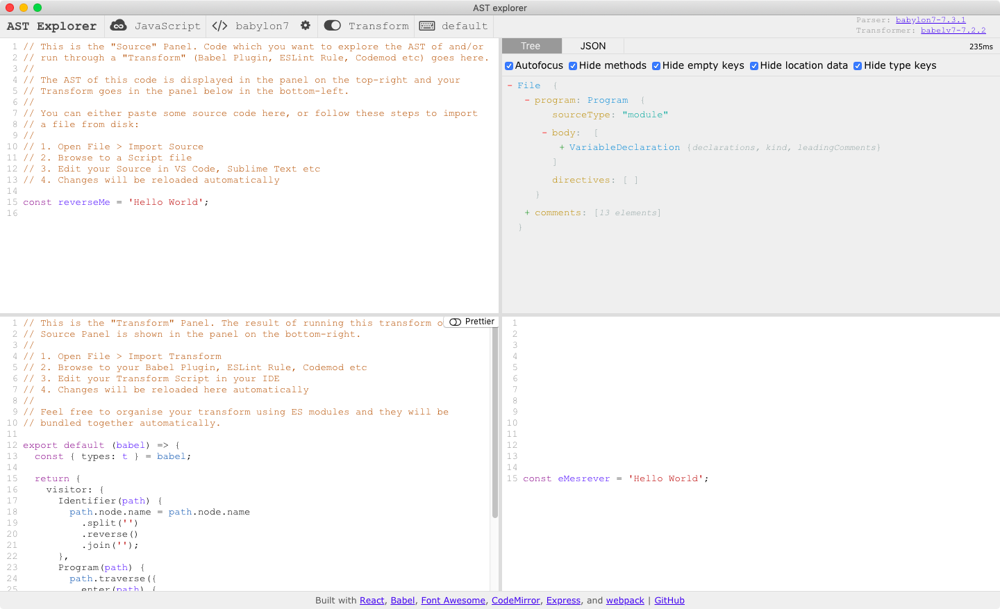

# ASTExplorer.app

> AST Explorer (https://astexplorer.net) with Desktop Integration

[](https://gitter.im/JamieMason/astexplorer)
[](https://www.paypal.me/foldleft)
[](https://opencollective.com/fold_left#backer)
[](https://opencollective.com/fold_left#sponsors)
[](https://github.com/igrigorik/ga-beacon)
[](https://github.com/JamieMason)
[](https://twitter.com/fold_left)

## Overview

Edit your
[Babel Plugin](https://babeljs.io/docs/en/plugins/#plugin-development),
[Codemod](https://medium.com/@cpojer/effective-javascript-codemods-5a6686bb46fb),
or [ESLint Plugin](https://eslint.org/docs/developer-guide/working-with-plugins)
from the comfort of your favourite Editor and have your changes hot reload in
AST Explorer.

<center></center>

## Status

Working as expected but some steps which could be automated or configurable are
currently manual steps. At the time of writing this project is only a few hours
old.

## Usage

```
git clone https://github.com/JamieMason/astexplorer.app.git
cd astexplorer.app
yarn install
yarn start
```

This early version is hardcoded to watch for changes to `/test/source.js` and
`/test/transform.js`. Edit these files in VS Code for example and have
ASTExplorer.app visible on a separate monitor. Each time you save a file AST
Explorer will update.

## Contributing

The Web UI used on https://astexplorer.net is built from source from its
repository at https://github.com/fkling/astexplorer and checked into this
repository at `/website` using the command `yarn run pull-upstream`. The UI is
unmodified except for adding `<script src="../inject.js"></script>` to
`/website/index.html`.

The `/website` directory is then wrapped in an Electron app to provide Desktop
Integration. `/main.js` launches the UI then watches the source and transform
files using [chokidar](https://github.com/paulmillr/chokidar). When these files
change, a message is sent to the UI using
[`ipcMain`](https://electronjs.org/docs/api/ipc-main), `/inject.js` listens for
these messages using
[`ipcRenderer`](https://electronjs.org/docs/api/ipc-renderer) then forwards the
changes to AST Explorer's Redux Store.
